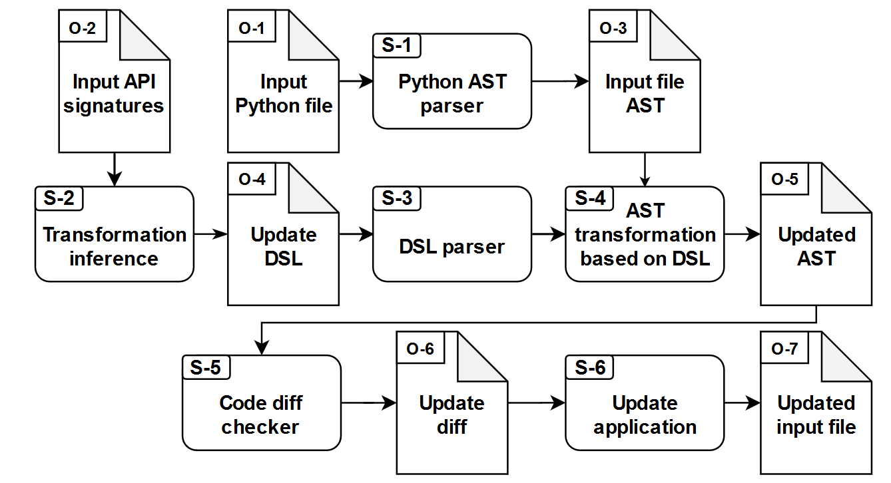

# MLCatchUp : Automated update for Python machine learning deprecated API usages

## Architecture
MLCatchUp provide an automated approach in the update of deprecated Python API usages. MLCatchUp infers the required transformation for the API update based on the differences between the deprecated and updated API signatures. This transformation operations are presented by MLCatchUp in DSL (domain specific language) script.

The following figure provide the overall architecture of MLCatchUp


There are two main functionalities within MLCatchUp:
1. Transformation Inference
Use the deprecated and updated API signatures mapping to create the DSL script that is used 
2. Transformation Application
Applies the created DSL script into the target file, updating all the specified deprecated APIs according to the inferred transformation operations.

## Usages

MLCatchUp can be accessed via a CLI (command line interface). Use main.py as the interface to use the functionality of MLCatchUp.

### Usage commands:
- Transformation Inference:  
``
Python main.py --infer <deprecated_api_signature> <updated_api_signature> --output <dsl_script_filepath>
``
- Transformation Application:  
``  
Python main.py -- transform --dsl <dsl_script_filepath> --input <deprecated_filepath> --output <output_filepath>
``

### API Signature Format:  
``
module.function_name(positonal_param1:param_type=param_default_value, *, keyword_param1:param_type=param_default_value)
``

### Examples:  
- Transformation Inference:  
``
python main.py --infer "torch.gels(input: Tensor, A: Tensor, out=None)" "torch.lstsq(input: Tensor, A: Tensor, out=None)" --output torch_gels.DSL
``

- Transformation Application:  
``
python main.py --transform --dsl torch_gels.dsl --input input_file.py --output updated_file.py
``

## Usage Examples

Consider the deprecated and updated API of 
```
deprecated: tensorflow.compat.v1.to_float()
updated: tensorflow.cast(dtype=tensorflow.float32)
```

Using the above API pairs as input, we instruct MLCatchUp to infer the required transformation:
```
python main.py --infer "tensorflow.compat.v1.to_float()" "tensorflow.cast(dtype=tensorflow.float32)" --output tensorflow_to_float.dsl
```

This results in the following DSL commands:
```
add_parameter dtype with_value tensorflow.float32 for tensorflow.compat.v1.to_float
rename_method tensorflow.compat.v1.to_float to tensorflow.cast
```

Then, consider the following deprecated API usages:
```
def _classification_probe(features):
  logits = snt.Linear(n_classes)(tf.stop_gradient(features))
  xe = tf.nn.sparse_softmax_cross_entropy_with_logits(logits=logits,
                                                      labels=labels)
  if labeled is not None:
    xe = xe * tf.to_float(labeled)
  xe = tf.reduce_mean(xe)
  acc = tf.reduce_mean(tf.to_float(tf.equal(tf.argmax(logits, axis=1),
                                            labels)))
  return xe, acc
```

We use the following commands to update the above deprecated API usages:
```
python main.py --transform --dsl tensorflow_to_float.dsl --input input_file.py --output updated_file.py
```
Which result in the following updated code:
```
def _classification_probe(features):
  logits = snt.Linear(n_classes)(tf.stop_gradient(features))
  xe = tf.nn.sparse_softmax_cross_entropy_with_logits(logits=logits,
                                                      labels=labels)
  if labeled is not None:
    xe = (xe * cast(labeled, dtype=tensorflow.float32))
  xe = tf.reduce_mean(xe)
  acc = tf.reduce_mean(cast(tf.equal(tf.argmax(logits, axis=1), labels), dtype=tensorflow.float32))
  return xe, acc
```

## Requirements:
- python 3.8
- astunparse==1.6.3
